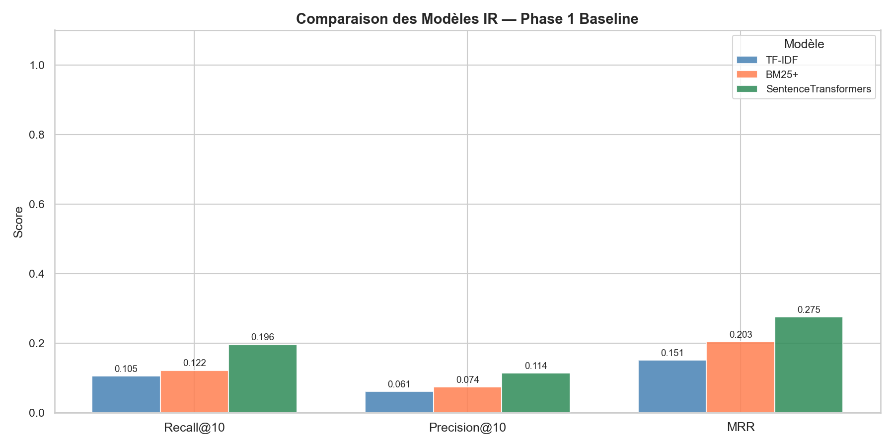

# Moteur de recherche d'information — Data Science Project

Projet de data science réalisé dans le cadre de la compétition Kaggle **retrieval-engine-competition** : construire un moteur de recherche capable, pour une question technique, de retrouver les documents pertinents dans un corpus de 216 000 documents, puis de prédire la catégorie de la question.

## Le problème

| | |
|---|---|
| Corpus | 216 041 documents (questions/réponses de forums techniques) |
| Requêtes d'entraînement | 327, avec leurs documents pertinents (≈ 9 par requête) |
| Requêtes de test | 141 |
| Catégories | `android`, `gaming`, `programmers`, `tex`, `unix` |

Chaque document et chaque requête a un `title`, un `text` et des `tags`. La soumission Kaggle associe à chaque requête de test une liste ordonnée de 100 documents et une catégorie prédite (`query_id, relevant_doc_ids, category`).

Deux tâches :
1. **Retrieval** : classer les documents du corpus par pertinence pour une requête.
2. **Classification** : prédire la catégorie de la requête.

## Démarche

### Phase 1 — Baselines de retrieval

- **EDA et prétraitement** : champ `content` = title + text + tags ; nettoyage (minuscules, ponctuation, stopwords NLTK, tokens courts).
- **TF-IDF** : unigrammes et bigrammes, `sublinear_tf`, similarité cosinus.
- **BM25+** (`rank_bm25`) : k1 = 1.5, b = 0.75, δ = 0.5.
- **Embeddings denses** : `all-MiniLM-L6-v2` (Sentence Transformers, 384 dimensions), embeddings normalisés et mis en cache. Visualisation de l'espace par t-SNE et UMAP : les catégories forment des clusters bien séparés.

### Phase 2 — Optimisation, classification et fusion

- **Construction de la requête** : encoder seulement le `text` de la requête, sans les tags, fait passer le MRR@10 de 0.27 à **0.46**. C'est le gain le plus important du projet.
- **Classifieur de catégorie** : régression logistique sur TF-IDF, entraînée sur les 216 000 documents (98 % d'accuracy sur les documents, 86 % sur les requêtes). Une variante en n-grammes de caractères (`char_wb`) atteint 98,8 % sur une validation des requêtes.
- **Reranking par catégorie** : `score + α · P(catégorie_requête = catégorie_doc)`, en version soft et en filtrage dur.
- **Fusion de classements** : Reciprocal Rank Fusion (embeddings + BM25+), puis ensembles pondérés de plusieurs runs, avec un routage selon la confiance du classifieur.

## Résultats

Évaluation sur les 327 requêtes d'entraînement, à K = 10.

| Méthode | MRR@10 | Recall@10 |
|---|---|---|
| TF-IDF (baseline) | 0.151 | 0.105 |
| BM25+ (baseline) | 0.203 | 0.122 |
| Embeddings (baseline, title + text + tags) | 0.275 | 0.196 |
| **Embeddings, requête = `text` seul** | **0.464** | **0.311** |
| Embeddings + reranking par catégorie | 0.460 | 0.310 |
| RRF (embeddings + BM25+) | 0.415 | 0.264 |



À retenir :
- Les embeddings sémantiques dominent nettement les méthodes lexicales sur ce corpus.
- Le reranking par catégorie n'apporte presque rien ici : il gagne un peu quand le classifieur a raison (280 requêtes) mais perd davantage quand il se trompe (47 requêtes).
- Avec seulement 327 requêtes, ces scores ont une variance élevée. Ils mesurent la performance sur l'entraînement, pas la généralisation.

## Organisation du dépôt

Le projet contient deux espaces de travail qui suivent le même pipeline : `chatodit/` et `val/`.

```
chatodit/
  notebooks/          01 à 09 (phase 1, tuning, classification, ensembles finaux)
  requirements.txt
val/
  notebooks/          01 à 08
  outputs/            graphiques, résultats et fichiers de soumission
  predict_category.py classifieur de catégorie autonome
  rapport_projet_ultra.pdf / .docx   rapport technique complet
```

| Notebook | Contenu |
|---|---|
| `01_eda` | Exploration des données et prétraitement du corpus |
| `02_tfidf` | Index TF-IDF et évaluation |
| `03_bm25` | Index BM25+ et évaluation |
| `04_embeddings` | Sentence Transformers, recherche sémantique, t-SNE / UMAP |
| `05_baseline_results` | Comparaison des baselines et première soumission |
| `06_parameter_tuning` | Stratégies de construction de requête, grid search BM25+ |
| `07_phase2_classification_reranking` | Classifieur de catégorie, reranking, RRF |
| `08_fast_ensemble_submission` | Fusion rapide de soumissions existantes |
| `09_deadline_final_ensemble` | RRF pondéré, routage par confiance, boost de catégorie |

## Reproduire

Les données, les index et les embeddings (≈ 1,7 Go) ne sont pas versionnés.

1. Installer les dépendances :
   ```bash
   pip install -r chatodit/requirements.txt
   ```
2. Télécharger les données de la compétition Kaggle *retrieval-engine-competition* et placer `docs.json`, `queries_train.json`, `qgts_train.json` et `queries_test.json` dans `val/data/` (ou `chatodit/data/`).
3. Exécuter les notebooks dans l'ordre depuis le dossier `notebooks/`. `01_eda` génère le corpus prétraité ; `02` à `04` construisent les index et les embeddings dans `models/`. L'encodage des 216 000 documents prend plusieurs dizaines de minutes sans GPU.
4. Pour la classification seule : `python val/predict_category.py`.

## Stack

Python · pandas · NumPy · scikit-learn · rank-bm25 · sentence-transformers · NLTK · UMAP · matplotlib / seaborn · Jupyter
# Data_Science_Project
